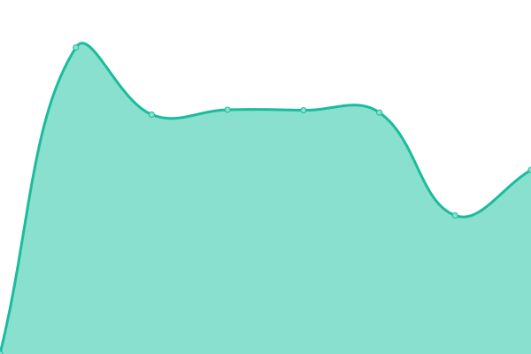

# [📈 Live Status](https://status.theATL.social): <!--live status--> **🟩 All systems operational**

This repository contains the open-source uptime monitor and status page for [theatl-social](https://status.theATL.social), powered by [Upptime](https://github.com/upptime/upptime).

With [Upptime](https://upptime.js.org), you can get your own unlimited and free uptime monitor and status page, powered entirely by a GitHub repository. We use [Issues](https://github.com/theatl-social/theatl-social-status-v2/issues) as incident reports, [Actions](https://github.com/theatl-social/theatl-social-status-v2/actions) as uptime monitors, and [Pages](https://status.theATL.social) for the status page.

<!--start: status pages-->
<!-- This summary is generated by Upptime (https://github.com/upptime/upptime) -->
<!-- Do not edit this manually, your changes will be overwritten -->
<!-- prettier-ignore -->
| URL | Status | History | Response Time | Uptime |
| --- | ------ | ------- | ------------- | ------ |
|  [theATL.social (Mastodon Web/API)](https://theATL.social/health) | 🟩 Up | [the-atl-social-mastodon-web-api.yml](https://github.com/theatl-social/theatl-social-status-v2/commits/HEAD/history/the-atl-social-mastodon-web-api.yml) | 

 446ms
     
 | 

<a href="https://status.theatl.social/history/the-atl-social-mastodon-web-api">100.00%</a>
    

|  [theATL.social (Mastodon Streaming)](https://theATL.social/api/v1/streaming/health) | 🟩 Up | [the-atl-social-mastodon-streaming.yml](https://github.com/theatl-social/theatl-social-status-v2/commits/HEAD/history/the-atl-social-mastodon-streaming.yml) | 

 48ms
     
 | 

<a href="https://status.theatl.social/history/the-atl-social-mastodon-streaming">100.00%</a>
    

|  [theATL.social (Mastodon Static Assets)](https://mastodon-static.theatl.social/sw.js) | 🟩 Up | [the-atl-social-mastodon-static-assets.yml](https://github.com/theatl-social/theatl-social-status-v2/commits/HEAD/history/the-atl-social-mastodon-static-assets.yml) | 

 309ms
     
 | 

<a href="https://status.theatl.social/history/the-atl-social-mastodon-static-assets">100.00%</a>
    

|  [theATL.social Public Timeline](https://theatl.social/api/v1/timelines/public?local=true&only_media=false) | 🟩 Up | [the-atl-social-public-timeline.yml](https://github.com/theatl-social/theatl-social-status-v2/commits/HEAD/history/the-atl-social-public-timeline.yml) | 

 420ms
     
 | 

<a href="https://status.theatl.social/history/the-atl-social-public-timeline">100.00%</a>
    

|  [theATL.social (Mastodon Media Proxy)](https://o1.theatl.social/theatlsocial-logo-output.png) | 🟩 Up | [the-atl-social-mastodon-media-proxy.yml](https://github.com/theatl-social/theatl-social-status-v2/commits/HEAD/history/the-atl-social-mastodon-media-proxy.yml) | 

 268ms
     
 | 

<a href="https://status.theatl.social/history/the-atl-social-mastodon-media-proxy">100.00%</a>
    

|  [theATL.social (Bluesky PDS)](https://theatl.social/xrpc/_health) | 🟩 Up | [the-atl-social-bluesky-pds.yml](https://github.com/theatl-social/theatl-social-status-v2/commits/HEAD/history/the-atl-social-bluesky-pds.yml) | 

 49ms
     
 | 

<a href="https://status.theatl.social/history/the-atl-social-bluesky-pds">100.00%</a>
    

|  [theATL.social Public Marketing Site](https://join.theATL.social) | 🟩 Up | [the-atl-social-public-marketing-site.yml](https://github.com/theatl-social/theatl-social-status-v2/commits/HEAD/history/the-atl-social-public-marketing-site.yml) | 

 320ms
     
 | 

<a href="https://status.theatl.social/history/the-atl-social-public-marketing-site">100.00%</a>
    

|  [theATL.social Members Site](https://members.theATL.social/login) | 🟩 Up | [the-atl-social-members-site.yml](https://github.com/theatl-social/theatl-social-status-v2/commits/HEAD/history/the-atl-social-members-site.yml) | 

 403ms
     
 | 

<a href="https://status.theatl.social/history/the-atl-social-members-site">100.00%</a>
    

|  [theATL.social (Phanpy Site)](https://phanpy.theATL.social) | 🟩 Up | [the-atl-social-phanpy-site.yml](https://github.com/theatl-social/theatl-social-status-v2/commits/HEAD/history/the-atl-social-phanpy-site.yml) | 

 175ms
     
 | 

<a href="https://status.theatl.social/history/the-atl-social-phanpy-site">100.00%</a>
    

|  [theATL.social (Lemmy Site)](https://yall.theATL.social) | 🟩 Up | [the-atl-social-lemmy-site.yml](https://github.com/theatl-social/theatl-social-status-v2/commits/HEAD/history/the-atl-social-lemmy-site.yml) | 

 2303ms
     
 | 

<a href="https://status.theatl.social/history/the-atl-social-lemmy-site">99.61%</a>
    

|  [theATL.social (Lemmy Media Storage)](https://pictrs-objstore.theatl.social/000/4bcb5f4f-cedb-4ea2-9180-a5433624d58d) | 🟩 Up | [the-atl-social-lemmy-media-storage.yml](https://github.com/theatl-social/theatl-social-status-v2/commits/HEAD/history/the-atl-social-lemmy-media-storage.yml) | 

 254ms
     
 | 

<a href="https://status.theatl.social/history/the-atl-social-lemmy-media-storage">100.00%</a>
    

|  [theATL.social (Sendgrid Email Provider Service)](https://sendgrid-status.theatl.social) | 🟩 Up | [the-atl-social-sendgrid-email-provider-service.yml](https://github.com/theatl-social/theatl-social-status-v2/commits/HEAD/history/the-atl-social-sendgrid-email-provider-service.yml) | 

 383ms
     
 | 

<a href="https://status.theatl.social/history/the-atl-social-sendgrid-email-provider-service">100.00%</a>
    

|  [marta.fail (MARTA Alert Status Updates)](https://marta.fail) | 🟩 Up | [marta-fail-marta-alert-status-updates.yml](https://github.com/theatl-social/theatl-social-status-v2/commits/HEAD/history/marta-fail-marta-alert-status-updates.yml) | 

 442ms
     
 | 

<a href="https://status.theatl.social/history/marta-fail-marta-alert-status-updates">98.70%</a>
    

|  [alerts.marta.fail (MARTA Alerts Bluesky Account)](https://alerts.marta.fail) | 🟩 Up | [alerts-marta-fail-marta-alerts-bluesky-account.yml](https://github.com/theatl-social/theatl-social-status-v2/commits/HEAD/history/alerts-marta-fail-marta-alerts-bluesky-account.yml) | 

 521ms
     
 | 

<a href="https://status.theatl.social/history/alerts-marta-fail-marta-alerts-bluesky-account">98.70%</a>
    

|  [MARTA Fail PDS Server](https://marta.fail/xrpc/_health) | 🟩 Up | [marta-fail-pds-server.yml](https://github.com/theatl-social/theatl-social-status-v2/commits/HEAD/history/marta-fail-pds-server.yml) | 

 47ms
     
 | 

<a href="https://status.theatl.social/history/marta-fail-pds-server">98.70%</a>
    

|  [PeachPie PyFedi Server](https://peachpie.theatl.social/health) | 🟩 Up | [peach-pie-py-fedi-server.yml](https://github.com/theatl-social/theatl-social-status-v2/commits/HEAD/history/peach-pie-py-fedi-server.yml) | 

 266ms
     
 | 

<a href="https://status.theatl.social/history/peach-pie-py-fedi-server">99.69%</a>
    

<!--end: status pages-->

[**Visit our status website →**](https://status.theATL.social)

## 📄 License

- Powered by: [Upptime](https://github.com/upptime/upptime)
- Code: [MIT](./LICENSE) © [Anand Chowdhary](https://anandchowdhary.com), supported by [Pabio](https://pabio.com)
- Data in the `./history` directory: [Open Database License](https://opendatacommons.org/licenses/odbl/1-0/)
